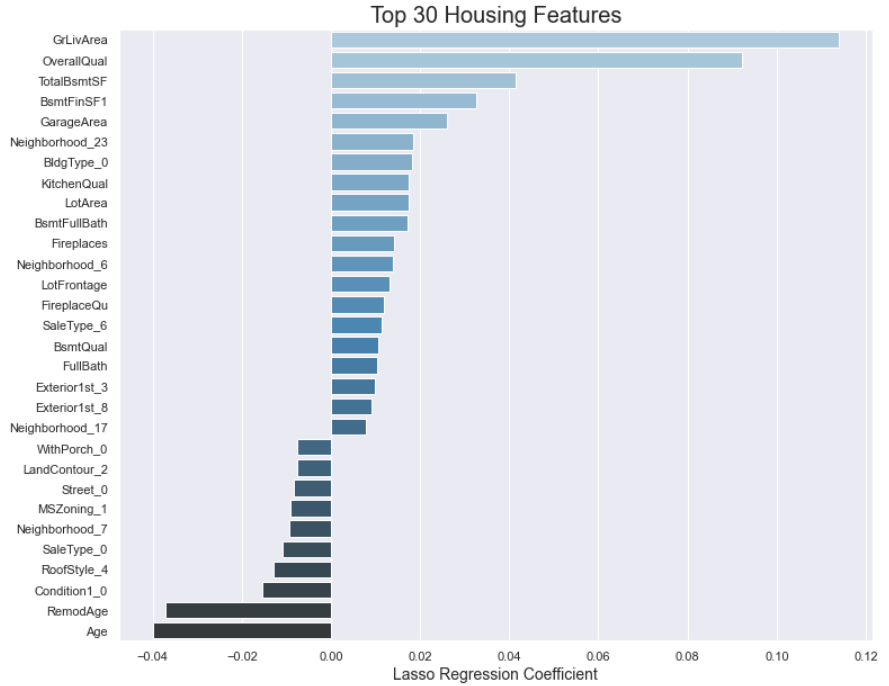

#  Project 2: Ames Housing Data and Kaggle Challenge

### Overview & Problem Statement

Have you ever looked at a nice house and said, “I wonder how much that’s worth?”
Perhaps you’ve fretted about the value of your own property, or got into a heated argument with a relative/potential buyer on the perceived price of your property.
What if there was a simple and effective solution to all of this?
Here’s what us data scientists at MetaQuark Realty aim to achieve - a simple solution so that you, the home buyer/owner to accurately predict the price of a property. 

There are are many variables that determine how much a home can fetch.
Using the Ames (IA) dataset (train, test), we want to find out which variables matters for home sale prices and produce accurate sale price predictions. 
This model will help provide the Outside View*, helping to reduce information asymmetry between potential home-buyers, home-sellers and real estate agents.

As the objective of the problem statement is to find a model with input features which is most predictive in estimating the sale price, I will be leveraging on linear regression, ridge and lasso respectively.  The model evaluation metrics will be based on R2 and root mean square error (RMSE).

### Datasets Used

#### Provided Data

Both model training and testing data are provided and the data dictionary can be referenced here [data description](http://jse.amstat.org/v19n3/decock/DataDocumentation.txt).

For additional validation of the model developed, GA has requested submission of predicted sale price by the final model to Kaggle.  Result will be shown in the last section of this README.me.  Here is an overview of the dataset received and what I have achieved by screening only those features which really matters for the model consumption (right of the picture).

### EDA Summary

At this point, the team starts with simple data investigation and analysis, starting with dataset understanding and then gradually progress into the visualization process.  The process involves computing summary statistics of the merged dataset, looking at simple trend and possible primitive relationship that can be observed.  This is a brief summary of the notable observations and the details can be referred to in the attached notebook.

1. The dataset comes with quite a number of columns with null value but after further investigation, most of the "NaN" value imported into notebook are actually valid category.  I will clarify further in next section in brief how the null values are handled.

2. As the objective is to develop a linear regression model, it is important to initially investigate the data column to ensure there are as many features available that can explain or has some form of relationship with the target which is sale price.  Below is a diagram of some interesting features which we can see to have such relationship.

3. Since we are leveraging on linear regression model, any form of serious outlier in the dataset could caused issue with the end result of the model.  And indeed we found there are as illustrated in the diagram below.

Next, we will move on to some details to be shared in feature engineering and how we shortlist the features list as we have a long list of columns here.

### Data Cleaning and Feature Engineering

Before we move on to do anything useful, it takes effort to firstly resolve the missing value and also the outlier.  One of the most important takeaway is nothing beats having a good understanding of the dataset by leveraging on the data dictionary before taking any decision to do imputation.  Please refer to diagram below on some of the approach I have taken to resolve the missing value.  Nothing rocket science, just pure good understanding of the data by taking serious effort in understanding the data dictionary.

Next, I have done iterative process to check correlation matrix on the available dataset and along the way dropping irrelevant features and also omitting features which are highly correlated that may lead to multicolinearity.

Lastly, beside leveraging on existing columns for the model, I have also leverage on some knowledge of the property market and also using some common sense to derive new meaningful features like below.

### Model Implementation

For this project, I have evaluated 3 different models like linear regression, Ridge and Lasso, against a simple mean baseline model.  After some experimentation, Lasso still gives better performance with R^2 of 0.8802586749267822 and RMSE of 20901.451276741733.  The below gives a "feel" of how the model has predicted the sale price against the actual price in test dataset.

The below diagram illustrated the top 30 features (either positively or negatively affect the sale price) derived from Lasso model.

### Conclusion & Recommendation

#### Conclusion:
Seeing the rank order on the importance of the features, we can see that our model is interpretable and make economic sense. Our top features are living area (GrLivArea), overall quality (OverallQual), basement related (both TotalBsmtSF and BsmtFinSF1), Garage dependent (GarageArea) and includes features like age and the quality of the exterior, kitchen, fireplace, bigger lot area. Quite of number of neighborhoods like Northridge Heights and Stone Brook also come up as strong positive predictors which again emphasize the fact that "Location is King".
I am also happy to see that some of the features I have engineered like both Age and RemodAge has make it into the top coefficient list. As they are negative, it means that for older property (Age is higher), it will be discounted more by the coefficient (-0.04) with everything else stay constant. Similary for houses which has newly done renovation (RemodAge will be smaller), the model will predict higher sale price with the smaller negative weightage on it.

Beside looking at what positively affect the sale price, we see that houses that are in The Old Town neighborhood also predicts lower prices.

All in all, the coefficients are interpretable and easy to explain to home seller or buyer.

#### Recommendation:
Based on our selected model (which is Lasso), MetaQuark Realty is in the position to recommend these factors to look out for, to both seller or buyer of property "in Ames". These are some factors (lower hanging fruits) that can be considered for enhancement or look for, since attribute like neighborhood the property belongs to and living area size are really something inherent.

Improving the fireplace as well.
Improve garage size if possible (GarageArea indicated).
Focus on improving the kitchen quality (KitchenQual).
Reduce the number of bedrooms in the house, or renovate existing bedrooms to make them multi-purpose rooms (if the house has more than three bedrooms).
Try to increase the overall quality of their home through renovation (as indicated by coefficient weightage of RemodAge, OverallQual)
Disclaimer: As the sample of training dataset are gathered and concentrated in city of Ames, the predicted sales price and predictive features may not be generalizable enough to be applied to other parts of US or the rest of the world as property market are largely contextual although some basic rules does applies.

### Kaggle Submission Result:

