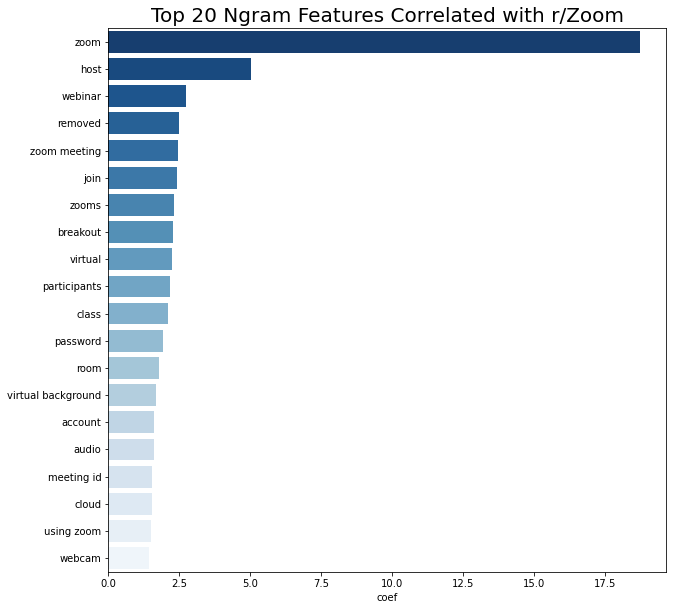
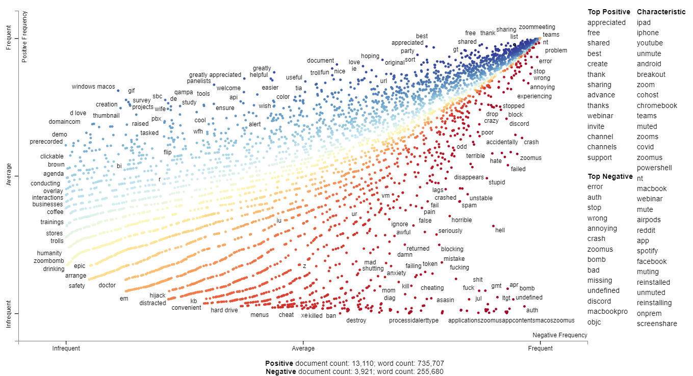

# Project 3 - Subreddit Classification with NLP

## Introduction

Reddit is a collection of interest-based communities known as subreddits, with members discussing a great variety of topics. Within each subreddit, users can create text or image posts, and upvote or downvote posts to express approval or disapproval regarding the content of the post. The number of upvotes and downvotes are fed into Reddit's hot-ranking algorithm to determine a score for the post, with higher scoring posts rising to the top of the subreddit.

We are part of the core team within the customer success department of Zoom International. With MST as our largest and fastest growing competitor, we want to examine what users have been discussing on Reddit by applying NLP techniques. We will then train a classifier to accurately classify content between the two sub-Reddits. Based on the model's we will make recommendations on two prongs - to the software development team and the marketing team:

1) Software Development Team - to highlight what are the common issues faced by users, as well as any additional features that users would like

2) Marketing - (i) to look at what features MST users have issues with (more than Zoom users) and tweak our campaigns to capitalise on their perceived weaknesses and (ii) to look at which words are closely associated with Zoom and MST. These words can considered for our Search Engine Marketing and Search Engine Optimisation campaigns. To utilise these words as paid keywords such as Google AdWords or organic keywords in our sites.

With the problem statement explained above, we have selected both subreddits -- r/Zoom and r/MicrosoftTeams. Both subreddits contain comments or issues raised quite actively by the community, mostly users of the individual platform.

In this project, I experimented with vectorizers including TfidfVectorizer and CountVectorizer using both Logistic Regression and Random Forest. I have also leverage on VEDA to perform a initial sentiment analysis to further explore the general perception of our platform (Zoom) versus Microsoft Team.

Since the extraction of the relevant data leveraging on the PushShift API may take long, I have decided to split my notebook into 2 separate copy. The first notebook would handle the extraction of the respective posting leveraging on PushShift API and the 2nd one includes code to perform standard data cleaning, EDA and Modelling. Since COVID pandemic, the volume of user using both platform has increased significantly and hence we have chose to analyze posting between the period starting year 2020 April and 2021 March.

## Executive Summary

To get the necessary posts for this project, we have scrapped data from both zoom and teams subreddit using the Python Reddit's PushShift API which gives access to each subreddit's between the duration of March 2020 to March 2021 as we believed this topics would be actively discussed during the onset of the COVID pandemic.

We then perform relevant EDA to understand the data better, do sentiment analysis comparison between the 2 subreddit, leverage on Scattertext to understand the various words that influence the sentiment and finally doing various hyperparameters tuning approach to evaluate the classification model (namely Logistic Regression and Random Forest) with TfidfVectorizer and CountVectorizer.  In conclusion, we selected TfidfVectorizer and Logistic Regression to be the best model with high AUC and F1-score.  The following diagram illustrates the comparison metrics and also the top features used in the model to predict zoom or team posting.

Beside the classification model, we have also leverage on the spacy Scattertext package to do elaborate keywords research as illustrated in the diagram below.

## Conclusion & Recommendation

In alignment with our problem statement, my team has done the relevant data analysis on both subreddit posting.  And these are some of the conclusion and follow up action which we can take based on the EDA analysis.

1. From the initial analysis completed on reddit specific like volume, upvote and others, we concluded subreddit is a good platform which we can continue to data mine the content from both subreddit to derive useful actionable plan that benefits Zoom.
- Although we have chosen a duration at the peak of the COVID pandemic, we would like to continue extracting information from the platform from 1st half of 2021 to 1st quarter of 2022 to better understand the needs of our user.  It is understandable that we may not do well at the beginning due to a large volume of organization switching on to Zoom from other competitors like Webex or Team, but would like to know how we have improved since March of 2021 to current date.
2. From the outcome of the VADER sentiment analysis, though we were disappointed to find out that the content posted by the Team subreddit subscriber are generally more positive but there are few things we can follow up.
- Here, we plan to filter out all zoom posting that scores a compound score of less than 0 and analyze in detail on the challenges or issues our user (assuming they are on subreddit) faced in general.  These outcome can eventually be feed into our product roadmap.
3. With the ScatterText, we do some detail analysis on some keywords and how they influence the sentiment on both Zoom as well as Team.
- For example, the keyword "android" is one of the top positive words used on Zoom subreddit and our user seems to be generally happy using the APP on android and we can continue leveraging on this strenght to see what we can further enhance as a product to do better.  Also, the keyword "video" seems to show more on the negative side of the sentiment and we can dive in further on posting that relates to it and understand better where we could improve on.

From classification model perspective, there are quite a few things we can certainly research on to better improve the performance and relevancy of the prediction.

1. Due to a lack of experiences working with Reddit Pushshift API, we could have omitted some useful information there which may potentially be good features that can be incorporated into our model to enhance the various metrics like AUC.  We did not include other data like upvotes and others since we do not find the information value to be high based on our analysis and hence we have chosen to simply work on the title and selftext column.

2. For this project, we have only evaluate both Logistic Regression and Random Forest.  We will consider to expand the scope of evaluation to other more sophisticate algorithm like Ada Boosting, Deep Learning and others.  Although interpretability is a big consideration for us (as we need to explain to management), with some of the clever package like SHAP & eli5, this is a definite area that we would like to explore next in the hope to enhance the classification model further (although it the AUC is already very high).

3. Due to a lack of sophistication, I have chosen only the more simpler model like CountVectorizer and TfidfVectorizer.  As we can see from the false positive analysis on both zoom and team related, it lacks a true understanding of the semantic meaning of words.  For example, the word "teams" is one of the most predictive feature in the model and without surprises, zoom related posting that contain such words were incorrectly classified.  In the last example above, the subscriber were referring to his "working team", and not Microsoft team per se. We will certainly try the latest algorithm like BERT transformer to see if it can resolve the above mentioned issue and hopeful brings down the false negative rate for the mentioned example.  